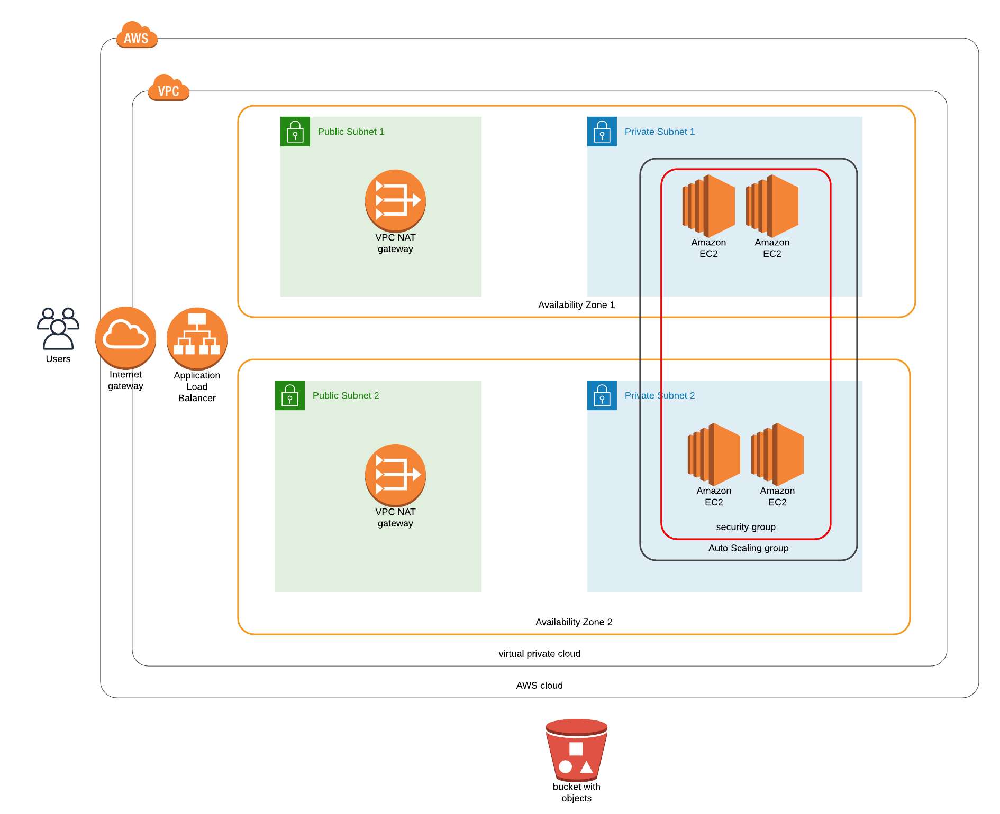

# Udacity cloud Devops Engineer Nanodegree - Project 2

This is an assignment for the [Udacity Devops Engineer Nanodegree](https://eu.udacity.com/course/cloud-dev-ops-nanodegree--nd9991) program.

The task was to deploy a high availability static website. The website should be hosted on servers within
private subnets. All trafic to the servers should be routed through NAT gateways located in public subnets.
For high availability there should not be any single point of failure and we should leverage auto scaling
as well as security best practices.

To deploy this infrastructure there is a helper script included in the repository. It can be used
like this: `./create.sh <STACKNAME> infra.yml params.json`

This is the infrastructure diagram for what this cloudformation script deploys:

